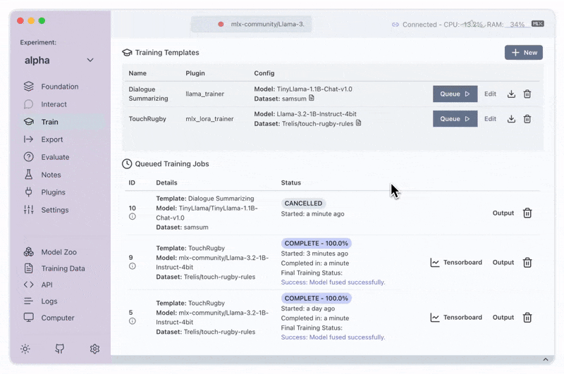

<div align="center">
  <a href="https://transformerlab.ai"><picture>
    <source media="(prefers-color-scheme: dark)" srcset="https://raw.githubusercontent.com/transformerlab/transformerlab-app/refs/heads/main/assets/Transformer-Lab_Logo_Reverse.svg">
    <source media="(prefers-color-scheme: light)" srcset="https://raw.githubusercontent.com/transformerlab/transformerlab-app/refs/heads/main/assets/Transformer-Lab_Logo.svg">
    
  </picture></a>

  <p align="center">
    100% Open Source Toolkit for Large Language Models: Train, Tune, Chat on your own Machine
    <br />
    <a href="https://transformerlab.ai/docs/download/"><strong>Download</strong></a>
    ·
    <a href="https://transformerlab.ai/docs/intro"><strong>Explore the docs »</strong></a>
    <br />
    <br />
    <a href="https://youtu.be/tY5TAvKviLo">View Demo</a>
    ·
    <a href="https://github.com/transformerlab/transformerlab-app/issues">Report Bugs</a>
    ·
    <a href="https://github.com/transformerlab/transformerlab-app/issues/new">Suggest Features</a>
    ·
    <a href="https://discord.gg/transformerlab">Join Discord</a>
    ·
    <a href="https://twitter.com/transformerlab">Follow on Twitter</a>
  </p>
  <p align="center">
   Note: Transformer Lab is actively being developed. Please join our Discord or follow us on Twitter for updates. Questions, feedback and contributions are highly valued!</p>
</div>

<!-- ABOUT THE PROJECT -->

## Download Now

[![Download Icon]][Download URL]

## About The Project



Transformer Lab is an app that allows anyone to experiment with Large Language Models.

## Backed by Mozilla

Transformer Lab is proud to be supported by Mozilla through the <a href="https://future.mozilla.org/builders/">Mozilla Builders Program</a>

<a href="https://future.mozilla.org/builders/">
    
</a>

## Features

Transformer Lab allows you to:

- 💕 **One-click Download Hundreds of Popular Models**:
  - DeepSeek, Llama3, Qwen, Phi4, Gemma, Mistral, Mixtral, Command-R, and dozens more
- ⬇ **Download any LLM from Huggingface**
- 🎶 **Finetune / Train Across Different Hardware**
  - Finetune using MLX on Apple Silicon
  - Finetune using Huggingface on GPU
- ⚖️ **RLHF and Preference Optimization**
  - DPO
  - ORPO
  - SIMPO
  - Reward Modeling
- 💻 **Work with LLMs Across Operating Systems**:
  - Windows App
  - MacOS App
  - Linux
- 💬 **Chat with Models**
  - Chat
  - Completions
  - Preset (Templated) Prompts
  - Chat History
  - Tweak generation parameters
  - Batched Inference
  - Tool Use / Function Calling (in alpha)
- 🚂 **Use Different Inference Engines**
  - MLX on Apple Silicon
  - Huggingface Transformers
  - vLLM
  - Llama CPP
- 🧑‍🎓 **Evaluate models**
- 📖 **RAG (Retreival Augmented Generation)**
  - Drag and Drop File UI
  - Works on Apple MLX, Transformers, and other engines
- 📓 **Build Datasets for Training**
  - Pull from hundreds of common datasets available on HuggingFace
  - Provide your own dataset using drag and drop
- 🔢 **Calculate Embeddings**
- 💁 **Full REST API**
- 🌩 **Run in the Cloud**
  - You can run the user interface on your desktop/laptop while the engine runs on a remote or cloud machine
  - Or you can run everything locally on a single machine
- 🔀 **Convert Models Across Platforms**
  - Convert from/to Huggingface, MLX, GGUF
- 🔌 **Plugin Support**
  - Easily pull from a library of existing plugins
  - Write your own plugins to extend functionality
- 🧑‍💻 **Embedded Monaco Code Editor**
  - Edit plugins and view what's happening behind the scenes
- 📝 **Prompt Editing**
  - Easily edit System Messages or Prompt Templates
- 📜 **Inference Logs**
  - While doing inference or RAG, view a log of the raw queries sent to the LLM

And you can do the above, all through a simple cross-platform GUI.

<!-- GETTING STARTED -->

## Getting Started

<a href="https://transformerlab.ai/docs/download">Click here</a> to download Transformer Lab.

<a href="https://transformerlab.ai/docs/intro">Read this page</a> to learn how to install and use.

### Built With

- [![Electron][Electron]][Electron-url]
- [![React][React.js]][React-url]
- [![HuggingFace][HuggingFace]][HuggingFace-url]

## Developers

### Building from Scratch

To build the app yourself, pull this repo, and follow the steps below:

(Please note that the current build doesn't work on Node v23 but it works on v22)

```bash
npm install
```

```bash
npm start
```

## Packaging for Production

To package apps for the local platform:

```bash
npm run package
```

<!-- LICENSE -->

## License

Distributed under the AGPL V3 License. See `LICENSE.txt` for more information.

## Reference

If you found Transformer Lab useful in your research or applications, please cite using the following BibTeX:

```
@software{transformerlab,
  author = {Asaria, Ali},
  title = {Transformer Lab: Experiment with Large Language Models},
  month = December,
  year = 2023,
  url = {https://github.com/transformerlab/transformerlab-app}
}
```

<!-- CONTACT -->

## Contact

- [@aliasaria](https://twitter.com/aliasaria) - Ali Asasria
- [@dadmobile](https://github.com/dadmobile) - Tony Salomone

<!-- MARKDOWN LINKS & IMAGES -->

[product-screenshot]: https://transformerlab.ai/assets/images/screenshot01-53ecb8c52338db3c9246cf2ebbbdc40d.png
[React.js]: https://img.shields.io/badge/React-20232A?style=for-the-badge&logo=react&logoColor=61DAFB
[React-url]: https://reactjs.org/
[Electron]: https://img.shields.io/badge/Electron-20232A?style=for-the-badge&logo=electron&logoColor=61DAFB
[Electron-url]: https://www.electronjs.org/
[HuggingFace]: https://img.shields.io/badge/🤗_HuggingFace-20232A?style=for-the-badge
[HuggingFace-url]: https://huggingface.co/
[Download Icon]: https://img.shields.io/badge/Download-EF2D5E?style=for-the-badge&logoColor=white&logo=DocuSign
[Download URL]: https://transformerlab.ai/docs/download
