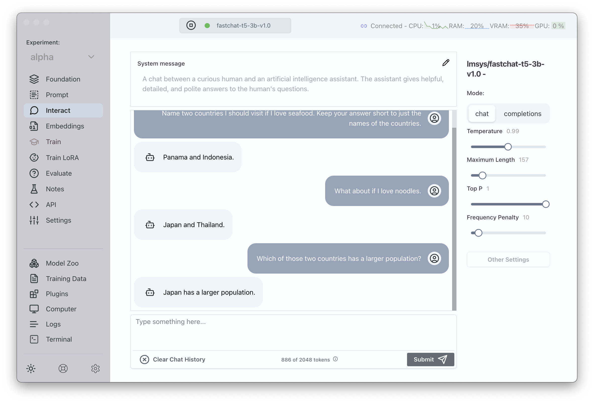

<!-- PROJECT LOGO -->
<br />
<div align="center">
  <a href="https://github.com/transformerlab/transformerlab-app">
    
  </a>

  <h1 align="center" style="color: rgb(68, 73, 80); letter-spacing: -1px">Transformer Lab</h1>

  <p align="center">
    Download, interact, and finetune models locally.
    <br />
    <a href="https://transformerlab.ai/docs/intro"><strong>Explore the docs »</strong></a>
    <br />
    <br />
    <a href="https://youtu.be/S-Ea5XAztPA?feature=shared">View Demo</a>
    ·
    <a href="https://github.com/transformerlab/transformerlab-app/issues">Report Bugs</a>
    ·
    <a href="https://github.com/transformerlab/transformerlab-app/issues/new">Suggest Features</a>
    ·
    <a href="https://discord.gg/transformerlab">Join Discord</a>
    ·
    <a href="https://twitter.com/transformerlab">Follow on Twitter</a>
  </p>
  <p align="center">
   ⚠️ Note: Transformer Lab is still early stage software (launched Jan 2024), and being actively worked on. Please join our Discord or follow us on Twitter for updates. Feedback and contributions are highly valued! ⚠️</p>
</div>

<!-- ABOUT THE PROJECT -->

## About The Project



Transformer Lab is an app that allows anyone to experiment with Large Language Models.

With Transformer Lab, you can:

- Download hundreds of popular models
- Interact with models through chat or completions
- Finetune models using a library of datasets, or your own data
- Evaluate models
- Access all of the functionality through a REST API

And you can do the above, all through a simple cross-platform GUI.

<!-- GETTING STARTED -->

## Getting Started

<a href="https://transformerlab.ai/docs/download">Click here</a> to download Transformer Lab.

<a href="https://transformerlab.ai/docs/intro">Read this page</a> to learn how to install and use.

### Built With

- [![Electron][Electron]][Electron-url]
- [![React][React.js]][React-url]
- [![HuggingFace][HuggingFace]][HuggingFace-url]

## Developers

### Building from Scratch

To build the app yourself, pull this repo, and follow the steps below:

```bash
npm install
```

```bash
npm start
```

## Packaging for Production

To package apps for the local platform:

```bash
npm run package
```

<!-- LICENSE -->

## License

Distributed under the AGPL V3 License. See `LICENSE.txt` for more information.

## Reference

If you found Transformer Lab useful in your research or applications, please cite using the following BibTeX:

```
@software{transformerlab,
  author = {Asaria, Ali},
  title = {Transformer Lab: Experiment with Large Language Models},
  month = December,
  year = 2023,
  url = {https://github.com/transformerlab/transformerlab-app}
}
```

<!-- CONTACT -->

## Contact

Ali Asaria - [@aliasaria](https://twitter.com/aliasaria)

<!-- MARKDOWN LINKS & IMAGES -->

[product-screenshot]: https://transformerlab.ai/assets/images/screenshot01-53ecb8c52338db3c9246cf2ebbbdc40d.png
[React.js]: https://img.shields.io/badge/React-20232A?style=for-the-badge&logo=react&logoColor=61DAFB
[React-url]: https://reactjs.org/
[Electron]: https://img.shields.io/badge/Electron-20232A?style=for-the-badge&logo=electron&logoColor=61DAFB
[Electron-url]: https://www.electronjs.org/
[HuggingFace]: https://img.shields.io/badge/🤗_HuggingFace-20232A?style=for-the-badge
[HuggingFace-url]: https://huggingface.co/
