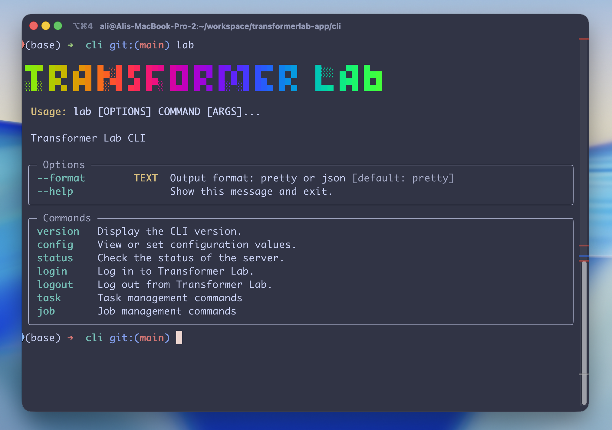
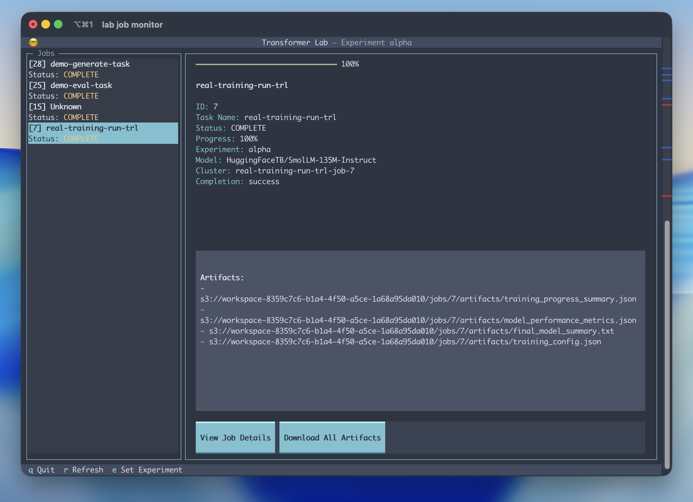

# Transformer Lab CLI





# Usage

## Install

(install instructions coming soon, for now follow Build Locally instructions below)

## Usage:

```
 Usage: lab [OPTIONS] COMMAND [ARGS]...

 Transformer Lab CLI

╭─ Options ────────────────────────────────────────────────────────────────────╮
│ --format        TEXT  Output format: pretty or json [default: pretty]        │
│ --help                Show this message and exit.                            │
╰──────────────────────────────────────────────────────────────────────────────╯
╭─ Commands ───────────────────────────────────────────────────────────────────╮
│ version   Display the CLI version.                                           │
│ config    View or set configuration values.                                  │
│ status    Check the status of the server.                                    │
│ login     Log in to Transformer Lab.                                         │
│ logout    Log out from Transformer Lab.                                      │
│ task      Task management commands                                           │
│ job       Job management commands                                            │
╰──────────────────────────────────────────────────────────────────────────────╯
```

# Development

## Run (DEV):

```
uv run src/transformerlab_cli/main.py
```

## Build Locally:
```
uv tool install .
```

or rebuild with:
```
uv tool install . --force --reinstall
```

Adds a `lab` command to your terminal

## Debug the Job Monitor:

```
pip install -e .
uv run textual run --dev src/transformerlab_cli/commands/job_monitor/job_monitor.py
```

Run in browser (for fun?)
```
uv run textual serve src/transformerlab_cli/commands/job_monitor/job_monitor.py
```
