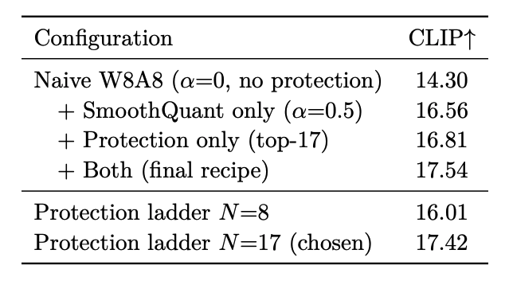
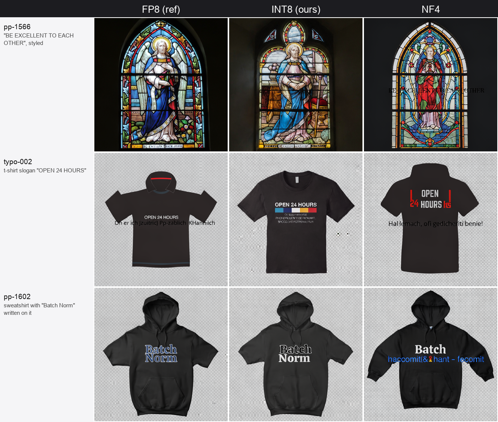

_INT8 and GGUF post-training quantization of Ideogram 4 on Ampere consumer GPUs, with the evidence behind each number._

> **Quick summary:** Ideogram released two builds of their new model — a high-quality version meant for massive data center GPUs, and a lower-quality version for consumer cards. We took the high-quality version, shrank it down to the memory footprint of the consumer build, and kept the premium performance intact.

<!--truncate-->

Released just days ago on June 3, 2026, Ideogram 4 is a 9.3-billion-parameter text-to-image model. Built on a flow-matching diffusion transformer paired with a Qwen3-VL-8B text encoder, it is widely considered the best open-weights text-to-image model available. The Ideogram team shipped two non-commercial versions on Hugging Face: an **FP8 build** (high quality) and an **NF4 build** (consumer-friendly, but lower quality).

We wanted to run the high-quality FP8 build efficiently on an **RTX 3090** (24 GB, Ampere architecture). However, Ampere lacks native FP8 tensor cores. This hardware limitation ends up driving the entire project: because an Ampere card can't run the FP8 checkpoint natively, it is forced to dequantize every layer back to bf16 on the fly. While it still technically runs, it is inefficient and completely misses the performance benefits FP8 would offer on a newer Hopper card.

To bypass the FP8 bottleneck, we built an INT8 (W8A8) version — using 8-bit weights and 8-bit activations — which Ampere hardware is specifically optimized to handle at high speeds. For users with even stricter low-memory setups, we also baked a couple of GGUF k-quants (Q8_0 and Q4_K). All-in-all, running these experiments across different setups and optimizations cost around 200 GPU-hours of RTX 3090 nodes.

The result is a model that fits seamlessly onto a 24GB consumer GPU without sacrificing the premium output quality of the original FP8 release.

## The main result

Naive INT8 quantization degrades this model. Not catastrophically, but measurably: CLIP score drops about 3 points and text gets mushy.

The fix is narrow. We profiled every linear layer in the network, tracking how spiky each one's activations get across the denoising steps, and the outliers were almost entirely the **FFN down-projections** (`feed_forward.w2`). A small number of layers carry the heavy outlier activations that 8-bit quantization handles badly.

So we kept **17 of them** in bf16, about 8% of the layers, and quantized the rest. That single change recovers essentially all the lost quality, and the recovery is sharp: protect 8 layers and the model is still broken (CLIP ~16.0); protect 17 and you are back at the ceiling (CLIP ~17.4). The difference is nine layers.

Here is the INT8 ablation on the 50-prompt quality slice:

With that, plus SmoothQuant and per-token dynamic activation scaling, INT8 lands at **Pick 18.96 / CLIP 17.42**, against the FP8 reference at 18.97 / 17.54. We checked this with paired same-seed bootstrap confidence intervals over 200 prompts: the INT8-vs-FP8 interval straddles zero on both metrics, so the two are statistically indistinguishable. Against the published NF4 baseline, INT8 is **+1.9 CLIP** with a confidence interval that excludes zero.

## Text rendering

Text is generally the first thing to break under quantization, and it is the most fragile part of this model, so it was the result we were least confident would survive.

Here is INT8 against the FP8 reference and NF4 on a few prompts:

INT8 (middle column) keeps the lettering legible and correctly spelled. NF4 (right) does not. Its OCR normalized edit distance is 0.760 against INT8's 0.704 (lower is better); INT8 is marginally ahead of the FP8 reference here, within noise.

## Size and speed

One caveat: INT8 weights are 8 bits each, the same as FP8, so the INT8 checkpoint is around 20 GB, in FP8's size class rather than smaller. On this stack there is no fused INT8 kernel yet, so it runs at roughly FP8/NF4 speed rather than faster. The Ampere INT8 hardware exists; the software path does not yet use it. We are working on an INT8 release with a custom kernel that turns the available hardware into an actual speedup. If you need memory savings today, the next section covers that.

## The GGUF result

The Pareto winner, better quality than NF4 at the same memory, is **GGUF Q4_K**: 4.5 bits per weight, **10.44 GB** (NF4's size class), beating NF4 by +0.84 Pick / +2.93 CLIP on our slice. Q8_0, for completeness, is quality-neutral (effectively lossless) at 19.7 GB.

The summary:

- **INT8**: matches FP8 quality and text fidelity; a speed-focused build with a custom kernel is in progress.
- **Q4_K**: the build to use when VRAM is tight. Better than NF4 at the same size.
- **Q8_0**: effectively lossless, if you want a clean 8-bit GGUF.

A comparison on general scenes across all four:

INT8 tracks FP8 most closely; the lower-bit variants drift more in fine layout but stay high quality. That distinction is worth noting on its own: a variant can move away from the reference in pixels while preserving quality. Pixel distance and quality are different axes. NF4 drifts and loses quality; INT8 drifts and does not.

## What we are releasing

- **The quantized weights**: gated on Hugging Face under a license matching Ideogram 4's non-commercial terms. Research use only.
  - Our INT8 model: [https://huggingface.co/transformerlab/ideogram-4-int8-w8a8](https://huggingface.co/transformerlab/ideogram-4-int8-w8a8)
  - Our Q4_K GGUF model: [https://huggingface.co/transformerlab/ideogram-4-gguf-q4_k](https://huggingface.co/transformerlab/ideogram-4-gguf-q4_k)
- An **arxiv paper** will be released soon which explains our experiments and ablations in detail.
- We will also release a **reproducibility package** along with the arxiv paper so anyone can reproduce the experiments we conducted.

## Takeaway

Two results we are confident in: an INT8 recipe that holds the FP8 quality ceiling and keeps text legible, and a 4-bit GGUF that beats the standard low-memory option at the same size. The mechanism underneath is worth remembering, that 17 fragile layers decide the outcome.

The broader point is one quantization keeps teaching: the most useful artifact is not always the headline one. Here the quiet 4-bit GGUF and a targeted layer-protection step did most of the practical work, while the INT8 result is a quality and portability win whose speed payoff depends on a kernel we are still writing.
