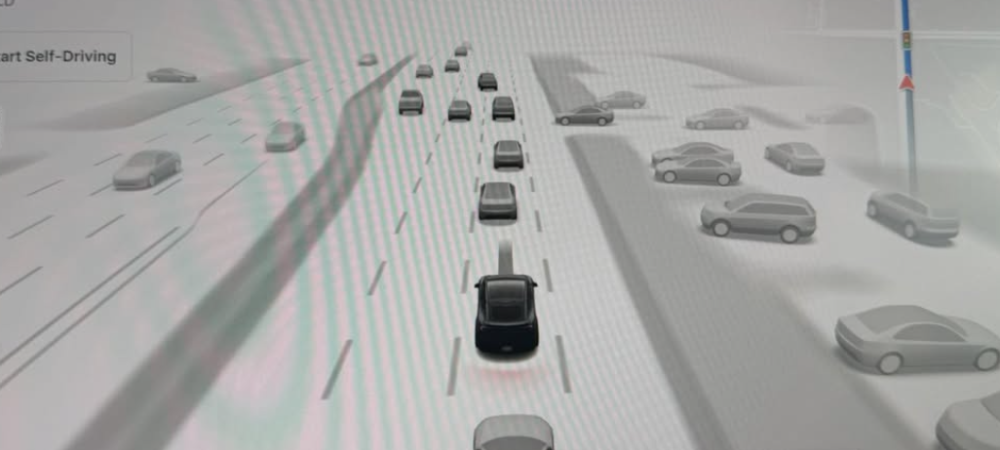
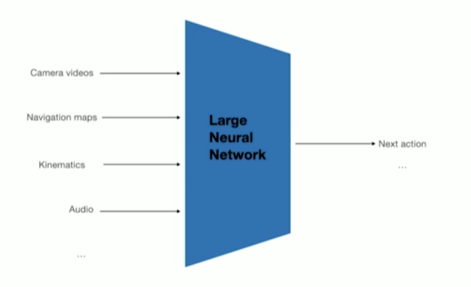
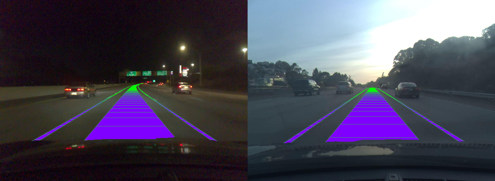

import AdaptationLadderDiagram from './AdaptationLadderDiagram';
import ParityScalingDiagram from './ParityScalingDiagram';
import FlipCollapseDiagram from './FlipCollapseDiagram';

The moment I learned about the mechanics behind self-driving car technology, I was hooked. There’s a specific, geeky thrill that comes from realizing just how difficult and elegant this problem is – and I knew, in that instant, that I had to try it for myself. But how the heck can I even start working on this problem? I finally found time to work on this problem over the last couple days.

A couple cool things about what I understand about Tesla Autopilot AI:

(Disclaimer: I do not have a background in self-driving AI technology, this is my first attempt in the space -- this project would be helpful for folks trying to build their first self-driving solution using available data)

<!--truncate-->

## 1. There is no intermediate representation:

Even though you see a digital visualization of the car's surroundings when driving a Tesla, the AI that drives the car _does not_ use that to steer the car. What Tesla uses is called a direct Vision to Action model. It's literally pixels in and actions out. The pictures of cars that the user sees are actually drawn _separately_ just for the user!

This is insane if you think about it.

## 2. The models are smallll

The other crazy thing about self-driving in cars is that the models have to be small enough to fit on a GPU that won't draw all the power of the car's limited battery. Late 2024 FSD models were likely only 4-8B parameters in size.

This is also insane.

I wanted to work on the general problem of self driving using Vision to Action models myself and see how far one person with a single GPU could get. 🤪

## What is a "vision-to-action" model, and why is it a cool problem?

A vision-to-action model takes raw perception (here, a camera image) and outputs an action (in my work, a steering angle) with **no hand-designed intermediate representation** in between. Contrast that with the classic robotics pipeline: detect objects, build a map, plan a path, then control. Each of those is a separate, human-specified module. The end-to-end approach throws the modules out and lets one network learn the whole image-to-control mapping from examples of humans driving.

The fact that this could work is insane to me.

## Step 1: Finding the dataset

Good news for hackers! comma.ai has released an awesome dataset for everyone: [about 33 hours of California highway driving](https://github.com/commaai/comma2k19), recorded as ~1-minute segments with a forward camera at 20 frames per second and synchronized car logs, including the actual steering-wheel angle at every moment. It is public and MIT-licensed, which made it perfect for a personal project. 🏆

The setup is clean: each camera frame is an input, and the steering angle the human was applying at that instant is the label I want the model to predict. Thousands of (image, steering-angle) pairs, straight from real drives.

## Step 2: Architecting the rig

I deliberately kept this small: a single GPU and a budget of roughly 100 GPU-hours. The point was to prove the whole loop works end to end on a hobbyist-scale setup, not to throw a datacenter at it.

> _Could I design a system that can take images in and steering instructions out, and maybe do a decent job at it?_

The pipeline I had to build: decode the compressed video into frames, match each frame to the steering angle from the car's log by timestamp, and, crucially, split the data into train and test sets **by route**, never by individual clip. That last part matters more than it sounds. Consecutive seconds of the same drive look almost identical, so if you split randomly you leak near-duplicate frames into both train and test and fool yourself into thinking the model is brilliant. Splitting by whole routes keeps the test honest.

Then I hit the real wall: **the data is wildly imbalanced.** Highway driving is overwhelmingly straight. About 94.5% of frames have the wheel within 15 degrees of center, leaving only ~5.5% that are actual turns. A lazy model can score great on average error by always predicting "go straight" and never learning to turn at all. The signal I cared about lived in the rare turns.

## Step 3: figuring out which model should work, from the literature

I tried to read as much research literature on this general problem as I could. My understanding is that comma.ai uses a **convolutional neural network** (CNN) style model, the traditional workhorse for images and what PilotNet used. But Tesla uses a **Vision Transformer** (ViT), the newer architecture behind a lot of modern computer vision.

From what I read, the conventional wisdom is blunt: ViTs are **data-hungry**. They lack the built-in "things that are near each other in an image are related" assumption that CNNs have baked in, so the story goes that they need huge datasets to compete. On a small slice of driving data, the literature basically predicts the CNN should win. That made it the perfect thing to actually test rather than assume.

After reading, I felt more confident (but not sure) that I could get a CNN to work if I designed it right, but... CNNs are boring! Getting a Transformer Model to work would be amazing. But the literature said it probably wouldn't be possible for someone working at my scale.

LET'S FIND OUT!

## Step 4: the experiments (and the part that surprised me)

My first attempts made the ViT look exactly as data-hungry as advertised. The two most obvious things you would try first both flop:

- Freeze the pretrained ViT and only train a small head on top (a "linear probe"): turn-quality correlation of 0.38, basically "this thing cannot steer."
- Add the standard left-right image flip as data augmentation (mirror the picture, flip the sign of the steering): the model collapses to predicting a constant.

Initial Result: on my first tests, my ViT based rig sucked at steering (but a CNN based model worked). I was planning on giving up on Transformers.

I started writing a blog post about how "transformers don't work on small driving data" and moved on. The breakthrough was realizing the problem was not the architecture, it was **how I was adapting it**. Same exact ViT backbone, three different ways of training it:

<AdaptationLadderDiagram />

Fine-tune the _whole_ network at a gentle learning rate and the same model that scored 0.38 jumps to 0.96. THAT'S GOOD. Nothing about the architecture changed. Only the adaptation did (and training with more data).

The other gotcha was that innocent-looking flip augmentation. On normal image tasks, flipping is free extra data. But on this lopsided steering distribution it actively destroys the model by reinforcing "predict zero." The tell was a simple diagnostic: the spread of the model's predictions collapsing to nearly zero, even while the training loss looked fine.

<FlipCollapseDiagram />

## Step 5: impressed by the results

Once adapted properly, the result genuinely surprised me. The supposedly data-hungry Vision Transformer **matched** the convolutional network at predicting steering, on as few as ~5,000 frames. On the turn slice (the part that matters), the ViT scored 0.964 and the CNN 0.967, a difference smaller than the run-to-run noise.

<ParityScalingDiagram />

As far as I know there are no public rigorous research projects that compare these two models on real driving data. I'll publish an official report in the next couple days.

## Step 6: Writing it up

Ok this was a fun experiment with a lot of simplifications:

- **It is offline only.** The model predicts the steering angle for recorded frames. I never put it in control of anything. Good prediction on a saved video does not mean it could drive, because real driving compounds small errors in ways an offline test never sees.
- **It is small and narrow.** A few hours of one dataset, one vehicle, mostly highway. No city streets, no weather, no night-vs-day stress test.
- **It is one learned component, not a system.** The vision-to-action mapping is the heart of the thing, but a real stack is much more.

But look, it works: it learns to steer effectively on real roads.

And it points right back at the thing that hooked me. My model goes straight from vision to action with no scene in between, exactly like the direct controller I was fascinated by. A future next step, and the direction the field (Tesla included) is heading, is to add a reasoning layer so the model can think about the scene before it acts, instead of only being able to reflexively map pixels to a steering angle. That is the next dream.

## You can try this too

Stay tuned and we'll release the code for the end working project on Github. Full paper is on its way too; we'll add the arXiv link here as soon as it's published.
