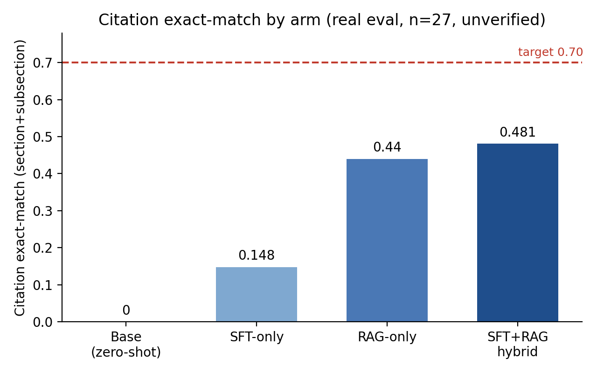
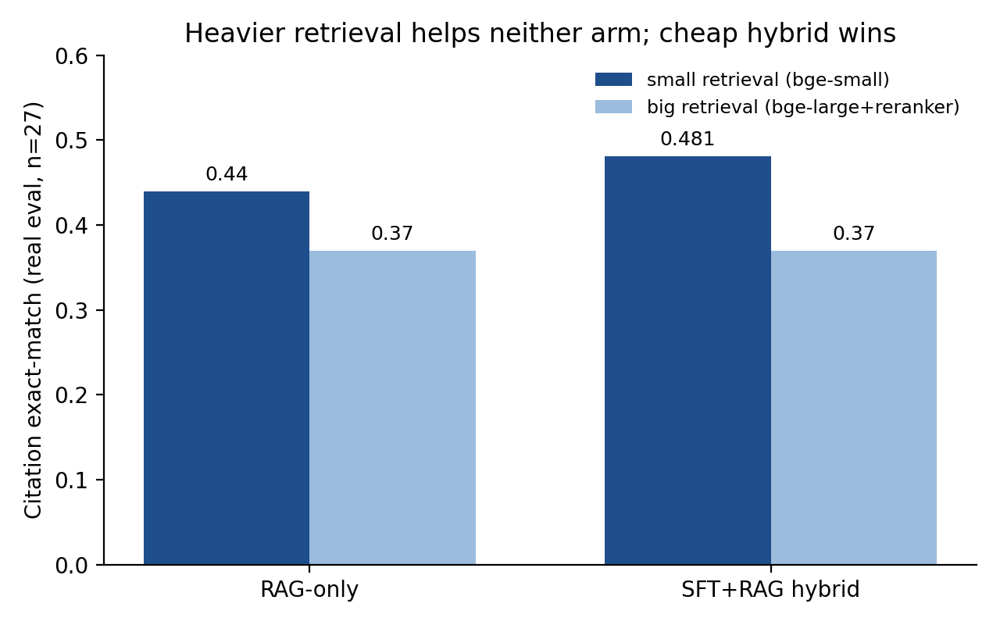

import FourArmDiagram from './FourArmDiagram';
import CandidateDepthDiagram from './CandidateDepthDiagram';

_We ran a four-arm head-to-head on Ontario tenancy law. Fine-tuning alone is not enough. Retrieval is the lever, and the right design drives hallucinated citations to zero._

> **Quick summary:** Self-represented tenants, landlords, and help-desk staff need to be pointed at the provision of law that governs their question, with a correct statutory citation. We tested whether you get there by fine-tuning a model, by retrieval, or both, on the Ontario _Residential Tenancies Act, 2006_ and its core regulation. We ran four arms on Qwen2.5-7B-Instruct: base zero-shot, LoRA fine-tuning, retrieval (RAG), and an SFT+RAG hybrid. The base model cannot cite the law: 0.00 citation exact-match, with 81% of its citations pointing to provisions that do not exist. Fine-tuning alone teaches the citation format but mis-recalls the actual section, reaching only 0.148. Retrieval is the decisive lever: it lifts exact-match to 0.44 and, because the model cites only from a verified inventory, drives hallucinations to zero by construction. The SFT+RAG hybrid scores highest at 0.481. The honest limit: 0.481 is well short of the 0.70 bar we set, and the eval set is 27 items, single-run, and human-verification-pending, so read the fine-grained numbers as preliminary.

<!--truncate-->

## Why you'd care

If you are building a system that answers questions over a fixed body of text and has to cite its source correctly, hallucinated citations are the thing that keeps it out of production. Legal text is a sharp test case: the answer is only useful if it points to the exact provision that governs, with the right Act, section, and subsection. We treated the citation, not the prose answer, as the quality target. A plain-language question like "how much notice must a landlord give to enter my unit?" has to come back mapped to a short answer plus the governing citation (here, RTA s. 26(1)). This is decision-support, not legal advice. The operator's question was concrete and falsifiable: is fine-tuning enough, or do you need retrieval? Rather than assume an answer, we measured it.

## The base model cannot cite the law

Ask an open 7B instruct model a tenancy-law question and it answers fluently and cites confidently. The citations are mostly invented. On our real eval set the base model scored 0.00 exact-match, and 81% of the citations it produced pointed to provisions that do not exist in the statute. Fluent answer, fabricated source. That is the gap.

## The setup: four arms, one metric

We parsed the e-Laws consolidation of the RTA (297 sections, 895 subsections, 20 Parts) and O.&nbsp;Reg. 516/06 (61 sections, 166 subsections) into an inventory of 358 provisions. Each provision is one structure-aware retrieval chunk, and the same inventory doubles as the whitelist for the hallucination check.

We score on **citation exact-match**: the predicted citation has to match the gold Act/regulation, section, and subsection. Getting the section right but the subsection wrong earns half credit, so the score is a partial-credit value in [0,1], not a strict pass/fail rate. A citation to a provision absent from the inventory counts as a hallucination. We also report multi-citation F1 and recall@k. The four arms, all on Qwen2.5-7B-Instruct: **base zero-shot**, **SFT-only** (LoRA on synthetic question→citation pairs), **RAG-only** (hybrid BM25 + bge-small retrieval, prompted to cite only from the retrieved context), and the **SFT+RAG hybrid** (the fine-tuned model selecting from retrieved candidates).

## The result: retrieval is the lever

Exact-match rises across the arms: base &laquo; SFT-only &laquo; the two retrieval-bearing arms.

The bar chart shows exact-match, but the other half of the story is what happens to hallucinations. Click through the arms:

<FourArmDiagram />

Fine-tuning alone is the weak arm. It cuts the hallucination rate from 81% to about 15% by teaching the model what a citation looks like, but it still mis-recalls the exact section and lands at 0.148 exact-match. Exact section numbers are a memorization weak spot for a 7B-class model. You cannot memorize your way to correct statutory citations at this scale.

Retrieval changes the picture. RAG-only reaches 0.44 and, because it is prompted to cite only from retrieved context drawn from the pinned inventory, its hallucination rate is 0.00. We want to be precise about this: the zero hallucination rate on the retrieval arms is largely guaranteed by the design, not learned. The model can only cite provisions that exist because those are the only provisions it is shown. We treat it as a design property, not an emergent result, and it is the property you want for anything legal.

The final model against the success-criteria gates:

| Metric                                    | Result | Target    | Verdict |
| ----------------------------------------- | ------ | --------- | ------- |
| Citation exact-match (section+subsection) | 0.481  | &ge; 0.70 | not met |
| Hallucinated-citation rate                | 0.00   | &le; 0.05 | met     |
| Lift over zero-shot base                  | +0.48  | &ge; 0.15 | met     |
| Evidenced train-vs-retrieve answer        | yes    | n/a       | met     |

And the full grid, with ablations:

| Arm                | Config                     | k      | recall@k  | Exact     | F1        |
| ------------------ | -------------------------- | ------ | --------- | --------- | --------- |
| base zero-shot     | n/a                        | n/a    | n/a       | 0.00      | 0.00      |
| SFT-only           | LoRA r32/400               | n/a    | n/a       | 0.148     | 0.167     |
| RAG-only           | bge-small, k=5             | 5      | 0.815     | 0.44      | 0.52      |
| RAG-only           | bge-small, k=10            | 10     | 0.889     | 0.37      | 0.46      |
| hybrid             | r32/400, k=5               | 5      | 0.815     | 0.333     | 0.43      |
| **hybrid (final)** | **r32/400, k=10**          | **10** | **0.889** | **0.481** | **0.574** |
| RAG-only           | bge-large + reranker, k=10 | 10     | 0.852     | 0.37      | n/a       |
| hybrid             | bge-large + reranker, k=10 | 10     | 0.852     | 0.37      | n/a       |

The hybrid scores highest at 0.481. We read its edge as fine-tuning making provision selection more robust to a larger candidate set, but at n=27 the roughly one-item margin over RAG-only is within noise, so we report it as suggestive, not a proven win.

## A candidate-depth pattern, offered as a hypothesis

There is a suggestive interaction between fine-tuning and how many candidates you retrieve. More retrieved candidates _hurt_ the zero-shot RAG model but _helped_ the fine-tuned model. Toggle the retrieval depth and watch the two arms swap places:

<CandidateDepthDiagram />

The reading is that fine-tuning teaches more robust selection from a noisier, higher-recall candidate set. We stress the limits: the deltas are one to four items on n=27, the comparison is confounded because recall also rises with k, and we did not measure the selection term directly. We offer it as a hypothesis, not an established effect.

## The efficiency result: heavier retrieval bought nothing

We expected a bigger retrieval stack to help. It did not. Swapping the cheap bge-small retriever for a larger embedder plus a cross-encoder reranker did not improve either arm: both the RAG-only and hybrid configurations landed at 0.37, below the cheap hybrid's 0.44 and 0.481. A larger training set (2,645 pairs) also did not beat the original, reaching 0.444.

On a 27-item set these cells carry overlapping uncertainty, so the safe reading is that heavier retrieval and more training data buy no measurable improvement on this short-statute corpus, not that the small retriever is provably better. For a latency- and cost-constrained deployment, that is a useful negative result.

## The honest ceiling, and where this does not work

At 0.481 exact-match the system is well below the 0.70 target we set. Three things bound the gap, and all of them ship with the result:

- **A retrieval-recall ceiling around 0.89.** Recall@10 is 0.889, so about 11% of the time the governing section is not in the top-10 candidates and no amount of selection can recover it. This is the dominant error mode.
- **Subsection-level difficulty.** The gap between F1 (0.574) and exact-match (0.481) is mostly the model getting the section right and the subsection wrong.
- **A tiny, human-verification-pending eval set.** The headline rides on 27 real questions, single-run, with no confidence intervals. One item moves a rate by about 0.037, so the fine-grained ordering among the retrieval-bearing arms is within noise.

Two further cautions. The final configuration (k=10) was chosen as the best-scoring cell on this same 27-item set, so the headline 0.481 is a max-over-configurations and is optimistically biased. And the real set scored higher than the larger synthetic slice (0.481 versus 0.327 on about 150 synthetic items), which tells us the real questions cluster on a few common, high-frequency provisions the retriever handles well. The headline likely overstates performance on the long tail; the better-powered 0.327 is arguably the more representative number for arbitrary questions.

Scope: this is one jurisdiction, one statute plus one regulation, one base model (Qwen2.5-7B; we did not evaluate Llama-3.1-8B), and training that is heavy on statute-derived synthetic questions. Legal-NLP components are known not to port cleanly across jurisdictions, so we make no claim beyond this setting.

## Takeaways

- **For citation-grounded QA, retrieval is the lever, not fine-tuning.** Fine-tuning a 7B model on question→citation pairs teaches the format and cuts obvious hallucinations, but it mis-recalls exact identifiers. The large step is from the non-retrieval arms to the retrieval-bearing arms.
- **Eliminate hallucinations by construction, not by training.** Cite only from a pinned, verified inventory and check every citation against it. That makes a zero hallucination rate a design property you can guarantee, which is what a legal application needs.
- **Try the cheap retriever first.** A small embedder hybrid matched or beat a larger embedder plus a reranker here, and more training data did not help. On a short corpus, reach for the heavy stack only after you have shown you need it.
- **Report the unflattering numbers.** The 0.70 miss, the n=27 caveat, the max-over-configurations selection bias, and the real-versus-synthetic gap are what make the 0.481 credible.

The whole study reproduces from public models and statute text and ran on about 4.4 GPU-hours end to end on Transformer Lab, so it is cheap to rerun. Artifacts (code, the synthetic question→citation dataset, and the trained LoRA adapter) are available from the authors on request.

## Links

Paper: [2606.20359](https://arxiv.org/abs/2606.20359)
