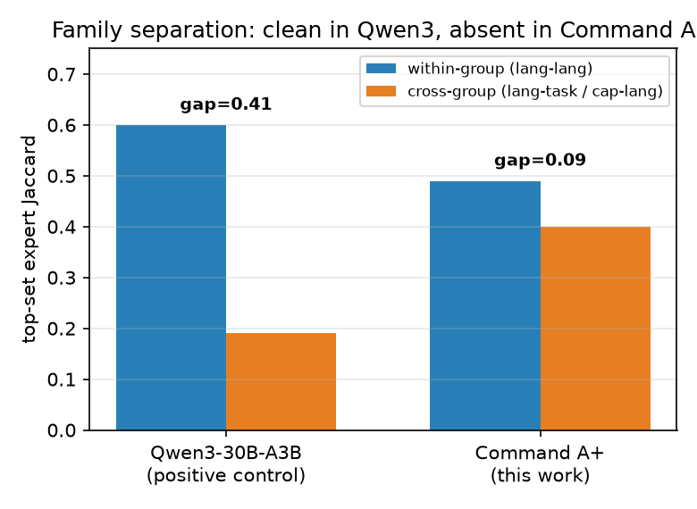
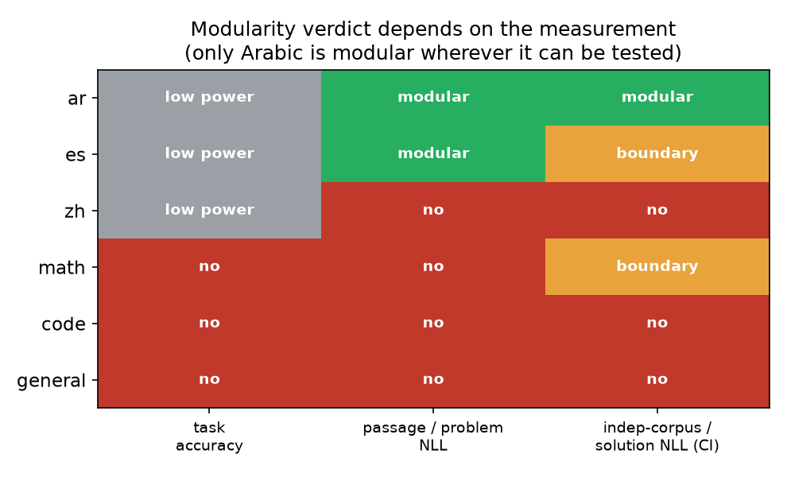

_A pre-registered causal test on Command A+ (218B). Of six candidate expert modules, only one survived a change of corpus, metric, and statistical bar._

When I first learned about Mixture-of-Experts models, the image that popped into my mind was the early-2000s game show _Beat The Geeks_. ICYMI: three contestants faced off against a panel of resident "geeks," each an obsessive specialist in one domain (the Simpsons Geek, the Beatles Geek, the Star Wars Geek, etc.). The panel of geeks would routinely take turns beating generalist contestants, even when given much harder questions.

With that image in my mind, I started to speculate on the possibilities of MoE modularity. A sparse Mixture-of-Experts model like Command A+ has 128 internal experts but only activates about 8 on any given token. Most of the model sits idle at any moment. If experts naturally specialize (e.g. a math geek, an Arabic geek, a code geek) you'd have a powerful handle on the model's behavior:

- **Safety:** monitor or remove a capability by acting on the experts that carry it.
- **Editing:** change one behavior without disturbing the rest.
- **Interpretability:** explain what a model does by explaining what its parts do.

<!--truncate-->

That speculation is what convinced our team to investigate. Routing studies keep finding hints that tokens of one kind tend to go to the same experts. But there's a gap between "tokens get _routed to_ certain experts" and "the model's output actually _depends on_ those experts." Routing is observational. Modularity is a causal claim. We wanted to close that gap on a real frontier model, measured honestly. So we did the test.

## The twist: only one survived

We pre-registered six candidate modules in Command A+ (218B total, 25B active, 128 experts) before touching anything: three language families (Arabic, Chinese, Spanish) and three capability families (math, code, general reasoning). For each one, we named the expert group and its job up front, then turned the group off and asked: does this break its own job while sparing everything else? And does it beat turning off the same number of random experts?

Only one survived: **Arabic.** But the other five didn't fail because they were unimportant. Every family except general reasoning had a real causal effect when ablated. The experts _mattered_. They just weren't _selective_. And whether they _looked_ modular depended on choices the analyst makes after the fact: which test corpus, which metric, how strict a statistical bar.

That's the key insight we built the study around. We treated the measurement itself as a variable by scoring the same ablations under four metrics, two separate corpora, and both a permissive and a conservative statistical rule. A real module should survive the change, but most didn't.

## The autopsy

What's interesting about this negative result is that each failed module fails for a _different_, instructive reason. It's not that modularity is uniformly absent. It's that it's fragile in specific, predictable ways.

**Spanish is corpus-dependent.** On the FLoRes-200 test passages, Spanish looks like a clean module: ablating it breaks Spanish and spares everything else. Switch to held-out Wikipedia text and it bleeds +0.43 nats into Arabic putting it right at the threshold. The Spanish and Arabic expert families share only 2 of their 16 experts, but that small overlap was enough to flip the verdict when the corpus changed. Same ablation, same model, different text, different answer.

**Math is metric-dependent.** Under task accuracy, math is entangled with general reasoning: ablating the math experts drops MATH-500 scores but _also_ drops MMLU-Pro. Under a solution-likelihood metric on the point estimates, it looks selective. But apply confidence intervals and it falls apart. The math-and-general entanglement only shows up when the off-target metric exercises shared reasoning.

**Code is metric-dependent the other way.** The code experts had zero detectable effect on HumanEval accuracy (0.00), yet produced the largest problem-text likelihood effect of any capability family (+1.29 nats) and bled heavily into math (+0.62). The code experts demonstrably _process_ code text. Whether they're _necessary_ for solving code tasks is a different question, and one our accuracy sample didn't have enough power to answer.

**Chinese and general reasoning** cleared neither bar.

## The one that survived and what it tells us

Ablating the Arabic family raised Arabic per-token loss by +1.80 nats, roughly a sixfold increase in perplexity, from about 8.2 to 49 (lower is better). That effect towers over the random-expert null, and it shows up on a corpus the family was never tuned to. Its worst off-target damage was +0.43 to English, well under the selectivity threshold. By every rule we applied, Arabic is a clean, causally localized language module.

| Family     | On-target effect [95% CI] | Random null band | Worst off-target | Verdict                     |
| ---------- | ------------------------- | ---------------- | ---------------- | --------------------------- |
| **Arabic** | **+1.80 [1.73, 1.86]**    | 0.64             | 0.43 (English)   | **Module**                  |
| Spanish    | +1.29 [1.23, 1.36]        | 0.58             | 0.43 (Arabic)    | Boundary — corpus-dependent |
| Math       | +0.37 [0.33, 0.41]        | 0.15             | 0.08 (general)   | Metric-dependent            |
| Code       | +0.49 [0.39, 0.61]        | 0.08             | 0.17 (math)      | Metric-dependent            |

So why Arabic and not the others? It appears that **representational axes localize better than computational ones.** Arabic is a surface property of the token distribution with a distinct script and lexicon that routing can cleanly factor out. Capability axes like math and code are _computations_ that share underlying machinery, and so they entangle. Representational modularity isn't guaranteed: Spanish is also a language and still failed, because its small expert overlap with Arabic was enough to break selectivity on a different corpus.

## Two more things we learned

**It's not a quantization artifact.** We studied a 4-bit quantized build, which is a fair reason to worry. We re-ran the key ablations on the full-precision BF16 model. The verdict reproduces: Arabic +1.81 nats (vs +1.80 in 4-bit), and every other family stays non-selective within a few hundredths.

**Routing mass doesn't predict what matters.** The most-routed "universal" shared core turned out to be causally redundant. Masking up to 32 of the most-shared experts degraded MMLU-Pro by only about 0.11, with no cliff, suggesting a distributed, redundant computation. How much an expert is used is not a reliable guide to what depends on it.

## What this means if you work on MoEs

An ablation-based "this is the X module" claim is not safe to act on unless it survives:

- **An independent corpus**: not the one you used to define the family.
- **A second metric**: especially one that exercises shared computation.
- **A conservative statistical bar**: bootstrap confidence intervals, not just point estimates.
- **A size-matched random-expert null**: turning off _any_ 16 experts hurts; a module has to beat that.

## Scope and limits

This is one frontier model plus one positive control (Qwen3-30B, where the pipeline cleanly recovered known language modules). This does not necessarily translate to a general claim about MoE families. The task-accuracy samples are small and single-seed, so some entanglement findings are underpowered. We tested language and capability families; retrieval, agentic, and safety families are untested.

The whole study reproduces from a public model and public data. We release the expert atlas (routing-mass matrix and frozen family map), the ablation result data, and an evidence ledger tracing every reported number to its source.

Repo: [github.com/transformerlab/exp-command-a-plus-moe-modularity](https://github.com/transformerlab/exp-command-a-plus-moe-modularity)

Full paper: [How Modular Is a Frontier Mixture-of-Experts?](/papers/expert-modularity-dissolves)

_Built on Cohere's Command A+, openly available under Apache-2.0. We do not redistribute the model._
