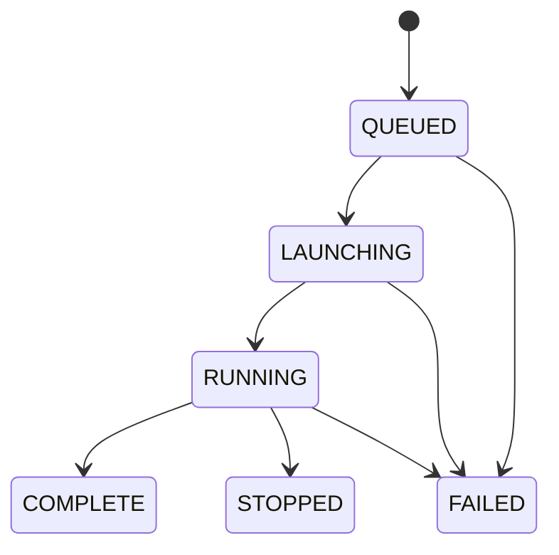
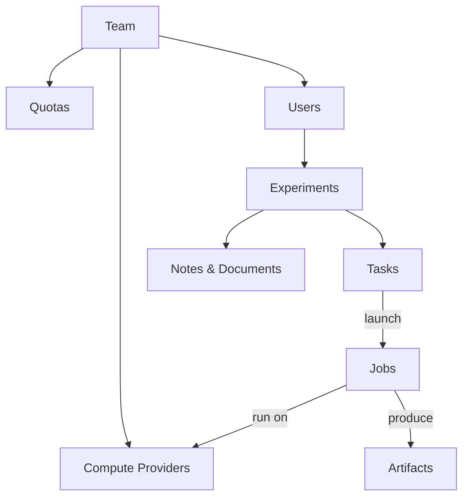

# Core Concepts

This page defines the key terms used throughout Transformer Lab and explains how they relate to each other.

## Teams

A team is a shared workspace for multiple users. Teams provide:

- **Shared experiments** — collaborate on the same research
- **Shared compute providers** — configured once, available to all members
- **Quotas** — team-level and per-user compute time limits
- **Access control** — role-based permissions (owner, member) with per-resource read/write rules

## Experiments

An experiment is the top-level container for organizing your work. It holds tasks, jobs, notes, and documents in one place. Think of it as a project folder for a line of research.

When you first use Transformer Lab, default experiments named `alpha`, `beta`, and `gamma` are created for you. You can create your own and name them however you like.

Everything you do — launching training runs, running evaluations, chatting with a model — happens inside an experiment.

## Tasks

A task is a **specification** for a piece of work. It defines what to run, what resources it needs, and where to run it.

Tasks are defined with a `task.yaml` file. Here's a minimal example:

```yaml
name: fine-tune-llama
resources:
  compute_provider: my-slurm-cluster
  accelerators: "NVIDIA"
  num_nodes: 1
envs:
  LEARNING_RATE: "0.001"
setup: |
  pip install -r requirements.txt
run: |
  python train.py
```

This is just a sample — task.yaml supports many more fields including GitHub repo integration, hyperparameter sweeps, and resource constraints. See the [Task YAML Structure](./running-a-task/task-yaml-structure.md) page for the full reference.

You can create tasks by uploading a YAML file, importing from a task gallery, or writing one from scratch in the built-in editor.

A task is a reusable template — each time you launch it, it creates a new **job**.

## Jobs

A job is a **running instance** of a task. When you launch a task, Transformer Lab creates a job, routes it to a compute provider, and tracks it through its lifecycle:



- **QUEUED** — submitted, waiting for the provider
- **LAUNCHING** — setup script running, dependencies installing
- **RUNNING** — main command executing
- **COMPLETE** — finished successfully
- **FAILED** — exited with an error
- **STOPPED** — stopped by the user

Each job produces logs and may produce artifacts like trained model weights, evaluation results, or exported files.

## Compute Providers

A compute provider is the backend that actually runs your jobs. Transformer Lab is provider-agnostic — you can configure one or more of the following:

| Provider | Use Case |
|----------|----------|
| **Local** | Run on the machine hosting Transformer Lab |
| **Slurm** | Submit to an on-premise HPC cluster |
| **SkyPilot** | Orchestrate across AWS, GCP, or Azure |
| **RunPod** | Serverless GPU cloud |
| **dStack** | Open-source distributed compute |
| **AWS / GCP / Azure** | Direct cloud VM provisioning |

When you launch a task, Transformer Lab translates your resource requirements into the provider's native format (e.g., an `sbatch` command for Slurm, a VM launch for cloud providers) and handles monitoring and log retrieval.

## How It All Fits Together


