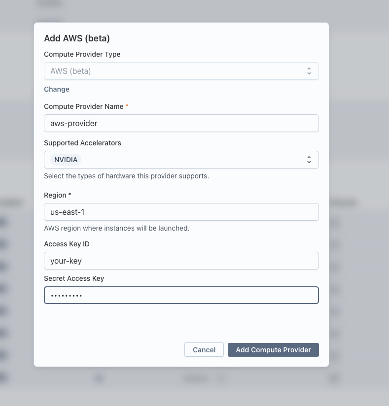

The AWS compute provider lets Transformer Lab launch ephemeral EC2 instances for training jobs directly from your AWS account. Each job gets its own instance, which self-terminates when the job finishes or crashes.

:::info Beta
The AWS provider is currently in beta.
:::

## How It Works

When you run a training task on an AWS provider, Transformer Lab:

1. Looks up (or creates) a dedicated security group, SSH key pair, and IAM role in your account.
2. Launches a new EC2 instance with the appropriate Deep Learning AMI.
3. Streams logs back over SSH while the job runs.
4. The instance terminates itself when the job completes or fails.

All created resources are tagged with your team ID and follow the `transformerlab-*` naming pattern.

## Prerequisites

- An AWS account with permission to create IAM users and policies.
- An IAM user with the policy described below. You will enter that user's access key in Transformer Lab.

## Step 1: Create an IAM User and Policy

### Create the policy

1. Open the [IAM console](https://console.aws.amazon.com/iam/) and go to **Policies → Create policy**.
2. Switch to the **JSON** editor and paste the policy from the [IAM requirements reference](#iam-policy-reference) below.
3. Name the policy `TransformerLabComputePolicy` and click **Create policy**.

### Create the user

1. In the IAM console, go to **Users → Create user**.
2. Give the user a name such as `transformerlab-compute`.
3. On the **Permissions** step, choose **Attach policies directly** and select `TransformerLabComputePolicy`.
4. Complete the user creation.

### Generate access keys

1. Open the newly created user, go to the **Security credentials** tab.
2. Click **Create access key**.
3. Choose **Application running outside AWS**, then click **Next**.
4. Copy the **Access key ID** and **Secret access key** — you will need both in the next step.

:::caution
Store these credentials securely. You will not be able to view the secret access key again after closing the creation dialog.
:::


## Step 2: Add the Provider in Transformer Lab

1. In Transformer Lab, open the **Team** page and go to **Compute Providers**.
2. Click **Add Compute Provider** and choose **AWS (beta)**.
3. Fill in the fields:

| Field | Description |
|---|---|
| **Compute Provider Name** | A friendly display name (e.g. `My AWS US-East`) |
| **Region** | The AWS region where instances will launch (e.g. `us-east-1`) |
| **AWS Access Key ID** | The access key ID from Step 1 |
| **AWS Secret Access Key** | The secret access key from Step 1 |

4. Click **Add Compute Provider**.

Transformer Lab will validate the credentials immediately. If validation fails, double-check that the policy is attached to the correct user.




## Step 3: Select the Provider for a Job

When creating a training task, expand the **Compute** section and select your new AWS provider from the dropdown. Choose your desired GPU type and count, then submit the job.

## Resources Created Automatically

Transformer Lab creates these once per team and reuses them on subsequent launches:

| Resource | Name Pattern | Purpose |
|---|---|---|
| Security group | `transformerlab-compute-<team_id>` | Allows SSH (port 22) inbound |
| Key pair | `transformerlab-<team_id>` | SSH access to instances |
| IAM role | `transformerlab-ec2-role-<team_id>` | Lets each EC2 instance terminate itself |
| IAM instance profile | `transformerlab-ec2-profile-<team_id>` | Wraps the role; attached to every launched instance |

## Supported GPU Types

The following GPU types are available. Specify them as `<type>:<count>` in task configuration (e.g. `A100:8`):

| GPU | Available Counts | EC2 Instance |
|---|---|---|
| T4 | 1, 4, 16 | NC4as_T4_v3 family |
| A10 | 1, 2 | g5 family |
| A100 | 1, 2, 4, 8 | p4d / p4de family |
| H100 | 8 | p5 family |
| V100 | 1, 2, 4, 8 | p3 family |

CPU-only instances are also supported; Transformer Lab selects the best fit based on the vCPU and memory requirements in your task.

## IAM Policy Reference

The following policy grants the minimum permissions required. Attach it to the IAM user whose credentials you configure in Transformer Lab.

```json
{
  "Version": "2012-10-17",
  "Statement": [
    {
      "Sid": "STSIdentity",
      "Effect": "Allow",
      "Action": "sts:GetCallerIdentity",
      "Resource": "*"
    },
    {
      "Sid": "EC2Launch",
      "Effect": "Allow",
      "Action": [
        "ec2:DescribeSecurityGroups",
        "ec2:CreateSecurityGroup",
        "ec2:AuthorizeSecurityGroupIngress",
        "ec2:DescribeKeyPairs",
        "ec2:ImportKeyPair",
        "ec2:DescribeImages",
        "ec2:RunInstances",
        "ec2:DescribeInstances",
        "ec2:TerminateInstances",
        "ec2:CreateTags"
      ],
      "Resource": "*"
    },
    {
      "Sid": "IAMSelfTerminationSetup",
      "Effect": "Allow",
      "Action": [
        "iam:GetRole",
        "iam:CreateRole",
        "iam:PutRolePolicy",
        "iam:GetRolePolicy",
        "iam:GetInstanceProfile",
        "iam:CreateInstanceProfile",
        "iam:AddRoleToInstanceProfile"
      ],
      "Resource": [
        "arn:aws:iam::*:role/transformerlab-ec2-role-*",
        "arn:aws:iam::*:instance-profile/transformerlab-ec2-profile-*"
      ]
    },
    {
      "Sid": "IAMPassRole",
      "Effect": "Allow",
      "Action": "iam:PassRole",
      "Resource": "arn:aws:iam::*:role/transformerlab-ec2-role-*"
    }
  ]
}
```

The IAM and EC2 permissions are scoped tightly: IAM actions only apply to resources named `transformerlab-ec2-role-*` and `transformerlab-ec2-profile-*`, so the credentials cannot be used to modify other roles or profiles in your account.

## Troubleshooting

### Credential validation fails immediately after adding the provider

- Confirm the policy is attached to the correct IAM user, not a group or role.
- Make sure the access key is active (IAM → User → Security credentials → Access keys).

### Instance fails to launch

- Check that the requested GPU type and count is available in your chosen region. Not all instance types are available in every region.
- If you hit EC2 service quotas, you may need to request a quota increase in the AWS Service Quotas console.

### Job shows as running but produces no logs

- The instance may still be bootstrapping. Allow a few minutes for the Deep Learning AMI to finish initializing.
- Check that port 22 is not blocked by a VPC-level network ACL in your account.
