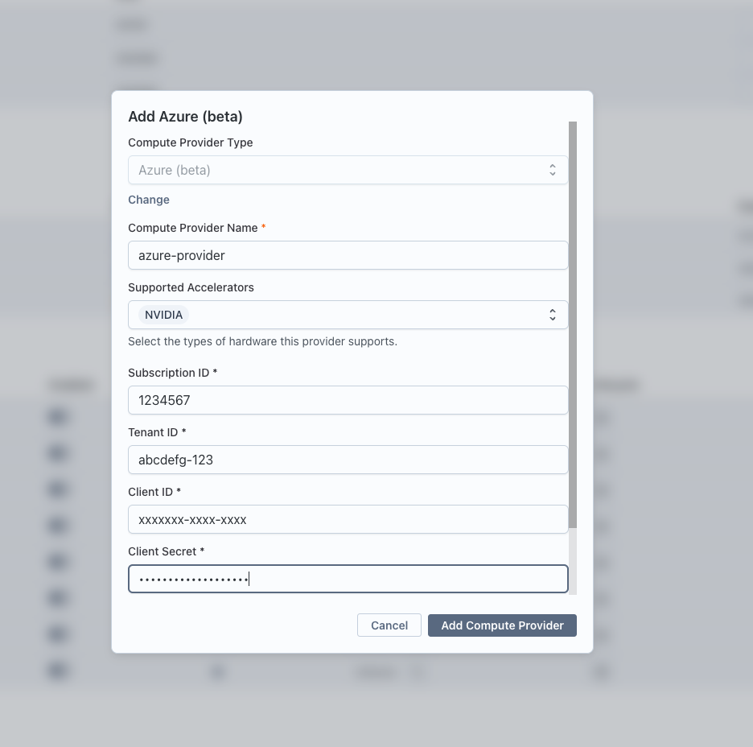

The Azure compute provider lets Transformer Lab launch ephemeral Azure VMs for training jobs directly from your Azure subscription. Each job gets its own VM, which self-terminates when the job finishes or crashes.

:::info Beta
The Azure provider is currently in beta.
:::

## How It Works

When you run a training task on an Azure provider, Transformer Lab:

1. Ensures a resource group, VNet, subnet, and network security group exist for your team.
2. Creates a NIC and public IP, then launches a new VM with Ubuntu 22.04.
3. Assigns a system-managed identity to the VM so it can delete itself via the Azure REST API.
4. Streams logs back over SSH while the job runs.
5. The VM deletes itself (and its NIC, public IP, and OS disk) when the job completes or fails.

All created resources are tagged with your team ID and follow the `transformerlab-*` naming pattern.

## Prerequisites

- An Azure subscription.
- Permission to create a Service Principal (App Registration) and assign roles in your subscription.

Transformer Lab authenticates to Azure using a **Service Principal with a client secret** (sometimes called an App Registration with a secret). You will create this below.

## Step 1: Create a Service Principal

1. Open the [Azure portal](https://portal.azure.com) and navigate to **Microsoft Entra ID → App registrations**.
2. Click **New registration**.
3. Give it a name such as `transformerlab-compute` and click **Register**.
4. Note the **Application (client) ID** and **Directory (tenant) ID** displayed on the overview page — you will need these later.

### Create a client secret

1. Inside the app registration, go to **Certificates & secrets → Client secrets**.
2. Click **New client secret**, add a description, choose an expiry, and click **Add**.
3. Copy the **Value** immediately — it is shown only once.

## Step 2: Assign Azure Roles

Transformer Lab needs two roles on your subscription (or on a pre-created resource group — see [Scope-Limiting Permissions](#scope-limiting-permissions) for a tighter setup).

| Role                          | Why It Is Needed                                           |
| ----------------------------- | ---------------------------------------------------------- |
| **Contributor**               | Create and manage VMs, networking, and the resource group  |
| **User Access Administrator** | Grant the VM's managed identity the right to delete itself |

### Assign both roles

1. In the Azure portal, navigate to **Subscriptions** and open your subscription.
2. Go to **Access control (IAM) → Add → Add role assignment**.
3. Search for **Contributor**, select it, and click **Next**.
4. On the **Members** tab, choose **User, group, or service principal**, then click **Select members** and find your `transformerlab-compute` app registration.
5. Click **Review + assign**.
6. Repeat the same steps for the **User Access Administrator** role.

## Step 3: Add the Provider in Transformer Lab

1. In Transformer Lab, open the **Team** page and go to **Compute Providers**.
2. Click **Add Compute Provider** and choose **Azure (beta)**.
3. Fill in the fields:

| Field                     | Where to Find It                                                          |
| ------------------------- | ------------------------------------------------------------------------- |
| **Compute Provider Name** | A friendly display name (e.g. `My Azure East US`)                         |
| **Subscription ID**       | Azure portal → Subscriptions → your subscription                          |
| **Tenant ID**             | App registration overview → Directory (tenant) ID                         |
| **Client ID**             | App registration overview → Application (client) ID                       |
| **Client Secret**         | The secret value you copied in Step 1                                     |
| **Location**              | Azure region for VMs (e.g. `eastus`, `westeurope`). Defaults to `eastus`. |

4. Click **Add Compute Provider**.

Transformer Lab will validate the credentials by making a lightweight subscription check. If validation fails, confirm the roles are assigned to the correct app registration.

## Step 4: Select the Provider for a Job

When creating a training task, expand the **Compute** section and select your new Azure provider. Choose the GPU type and count, then submit the job.

## Resources Created Automatically

Transformer Lab creates these once per team and reuses them on subsequent launches. The resource group is created automatically and named `transformerlab-<team_id>` by default.

| Resource               | Name Pattern                        | Purpose                                     |
| ---------------------- | ----------------------------------- | ------------------------------------------- |
| Resource group         | `transformerlab-<team_id>`          | Container for all Transformer Lab resources |
| Virtual network        | `transformerlab-vnet-<team_id>`     | Private network for VMs                     |
| Subnet                 | `transformerlab-subnet-<team_id>`   | Subnet inside the VNet                      |
| Network security group | `transformerlab-nsg-<team_id>`      | Allows SSH (port 22) inbound                |
| Public IP (per VM)     | `transformerlab-pip-<cluster_name>` | Enables SSH access and self-termination     |
| NIC (per VM)           | `transformerlab-nic-<cluster_name>` | VM network interface                        |

Public IPs and NICs are deleted when a job finishes.

## Supported GPU Types

| GPU  | Available Counts | Azure VM Series               |
| ---- | ---------------- | ----------------------------- |
| T4   | 1, 4, 16         | NCas_T4_v3                    |
| A10  | 1, 2             | NVads_A10_v5                  |
| A100 | 1, 2, 4, 8       | NCads_A100_v4 / NDasr_v4      |
| H100 | 1, 2, 8          | NCads_H100_v5 / NDisr_H100_v5 |
| V100 | 1, 2, 4          | NCs_v3                        |

CPU-only instances are also supported; Transformer Lab selects the smallest VM that satisfies the vCPU and memory requirements in your task.

## Required Azure Permissions Reference

The following table lists every Azure operation Transformer Lab performs, grouped by resource type.

### Subscription / Identity

| Operation                                | Why                              |
| ---------------------------------------- | -------------------------------- |
| `Microsoft.Resources/subscriptions/read` | Provider health check on startup |

### Resource Groups

| Operation                                                | Why                                                 |
| -------------------------------------------------------- | --------------------------------------------------- |
| `Microsoft.Resources/subscriptions/resourcegroups/write` | Create the team resource group if it does not exist |

### Networking

| Operation                                               | Why                                              |
| ------------------------------------------------------- | ------------------------------------------------ |
| `Microsoft.Network/networkSecurityGroups/read`          | Check whether the team NSG exists                |
| `Microsoft.Network/networkSecurityGroups/write`         | Create the team NSG with an SSH allow rule       |
| `Microsoft.Network/virtualNetworks/write`               | Create the team VNet and subnet                  |
| `Microsoft.Network/virtualNetworks/subnets/read`        | Read subnet ID for VM NIC creation               |
| `Microsoft.Network/virtualNetworks/subnets/join/action` | Attach NIC to the subnet on VM creation          |
| `Microsoft.Network/publicIPAddresses/write`             | Create a public IP for each VM                   |
| `Microsoft.Network/publicIPAddresses/read`              | Read public IP after creation for SSH access     |
| `Microsoft.Network/publicIPAddresses/delete`            | Delete per-job public IP after the VM terminates |
| `Microsoft.Network/networkInterfaces/write`             | Create a NIC for each VM                         |
| `Microsoft.Network/networkInterfaces/delete`            | Delete per-job NIC after the VM terminates       |

### Compute

| Operation                                  | Why                                  |
| ------------------------------------------ | ------------------------------------ |
| `Microsoft.Compute/virtualMachines/write`  | Launch a VM for each job             |
| `Microsoft.Compute/virtualMachines/read`   | Poll VM status and get instance view |
| `Microsoft.Compute/virtualMachines/delete` | Stop/remove a VM on demand           |

### Authorization (VM self-termination)

| Operation                                       | Why                                                                                     |
| ----------------------------------------------- | --------------------------------------------------------------------------------------- |
| `Microsoft.Authorization/roleAssignments/write` | Assign Virtual Machine Contributor to the VM's managed identity so it can delete itself |

The **Contributor** role covers all networking and compute operations. **User Access Administrator** covers the authorization operation.

## Scope-Limiting Permissions

For tighter security you can restrict the Service Principal to a specific resource group instead of the whole subscription. The trade-off is that you must create the resource group yourself **before** adding the provider.

1. Determine your team ID in Transformer Lab (visible on the Team page).
2. Create a resource group named `transformerlab-<your-team-id>` in your chosen location.
3. Assign **Contributor** and **User Access Administrator** to the `transformerlab-compute` Service Principal on **that resource group** (not on the subscription).
4. When adding the provider in Transformer Lab, ensure the **Location** matches the region of the pre-created resource group.

With this setup, the Service Principal cannot create or modify resources outside that resource group.

## Troubleshooting

### Credential validation fails immediately after adding the provider

- Confirm both roles are assigned to the **Application (client) ID**, not to a user account.
- Make sure the client secret has not expired.
- Check that the Subscription ID, Tenant ID, and Client ID all match the App Registration.

### VM launch fails with an image error

- Some GPU VM sizes require an image that is not available in every region. Try a different **Location** (region) or a different GPU type.
- Check Azure Compute quotas for the target VM family in the Azure portal under **Subscriptions → Usage + quotas**.

### VM launches but produces no logs

- The VM may still be bootstrapping. GPU VMs can take several minutes to finish initializing.
- Verify that port 22 is not blocked by a custom NSG rule or Azure Policy you have applied.

### Role assignment fails with "RoleAssignmentExists"

This error is harmless — it means the VM's managed identity already has the required role. Transformer Lab handles this gracefully and continues with the job.
