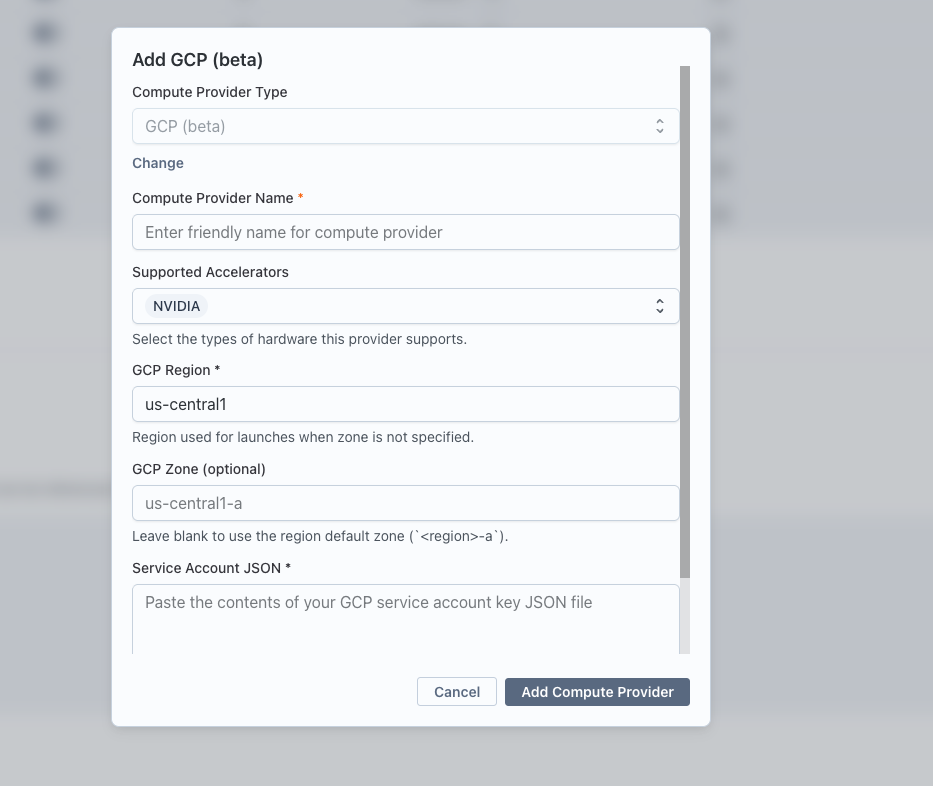

The GCP compute provider lets Transformer Lab launch ephemeral Google Compute Engine VMs for training jobs directly from your Google Cloud project. Each job gets its own VM, which self-terminates when the job finishes or crashes.

:::info Beta
The GCP provider is currently in beta.
:::

## How It Works

When you run a training task on a GCP provider, Transformer Lab:

1. Ensures a firewall rule exists on the `default` VPC that allows SSH to instances tagged `transformerlab-compute`.
2. Launches a new Compute Engine VM in the configured zone using a Deep Learning VM image (for GPU jobs) or an Ubuntu 22.04 image (for CPU jobs).
3. Attaches your service account to the VM so it can call the Compute Engine API to delete itself.
4. Streams logs back over SSH while the job runs.
5. The VM deletes itself (and its boot disk) when the job completes or fails.

All VMs are labelled with your team ID (`transformerlab-team-id`) and cluster name (`transformerlab-cluster-name`), and tagged `transformerlab-compute`.

## Prerequisites

- A Google Cloud project with the **Compute Engine API** enabled.
- Permission to create service accounts and grant IAM roles in that project.

Transformer Lab authenticates to GCP using a **service account key (JSON)**. You will create one below.

## Step 1: Enable the Compute Engine API

1. Open the [Google Cloud Console](https://console.cloud.google.com) and select your project.
2. Navigate to **APIs & Services → Library**, search for **Compute Engine API**, and click **Enable**.

## Step 2: Create a Service Account

1. In the Cloud Console, go to **IAM & Admin → Service Accounts**.
2. Click **Create service account**.
3. Give it a name such as `transformerlab-compute` and click **Create and continue**.
4. On the **Grant this service account access to project** step, add the following roles:

| Role                                                      | Why It Is Needed                                                                      |
| --------------------------------------------------------- | ------------------------------------------------------------------------------------- |
| **Compute Admin** (`roles/compute.admin`)                 | Create, read, and delete VMs, disks, and firewall rules                               |
| **Service Account User** (`roles/iam.serviceAccountUser`) | Attach the service account to launched VMs so each VM can delete itself on completion |

5. Click **Done**.

:::tip Tighter scopes
If `Compute Admin` is broader than you want, see [Required GCP Permissions Reference](#required-gcp-permissions-reference) below for the minimum operations Transformer Lab actually performs. You can build a custom role from that list.
:::

### Generate a JSON key

1. Open the newly created service account and go to the **Keys** tab.
2. Click **Add key → Create new key**, choose **JSON**, and click **Create**.
3. The key file downloads automatically. Open it in a text editor — you will paste its contents into Transformer Lab in the next step.

:::caution
Treat the key file like a password. Anyone with the JSON can launch resources in your project. Store it securely and delete the local copy once it is added to Transformer Lab.
:::

## Step 3: Add the Provider in Transformer Lab

1. In Transformer Lab, open the **Team** page and go to **Compute Providers**.
2. Click **Add Compute Provider** and choose **GCP (beta)**.
3. Fill in the fields:

| Field                     | Description                                                                                          |
| ------------------------- | ---------------------------------------------------------------------------------------------------- |
| **Compute Provider Name** | A friendly display name (e.g. `My GCP US-Central`)                                                   |
| **GCP Region**            | Region used for launches when zone is not specified (e.g. `us-central1`)                             |
| **GCP Zone** _(optional)_ | Specific zone to launch in (e.g. `us-central1-a`). Leave blank to default to `<region>-a`.           |
| **Service Account JSON**  | Paste the entire contents of the JSON key file from Step 2. The `project_id` is read from this file. |

4. Click **Add Compute Provider**.

Transformer Lab will validate the credentials by making a lightweight Compute Engine API call. If validation fails, double-check that the Compute Engine API is enabled and that the service account has the roles above.

## Step 4: Select the Provider for a Job

When creating a training task, expand the **Compute** section and select your new GCP provider. Enter the GPU resources required, then submit the job.

## Resources Created Automatically

Transformer Lab creates these in your project and reuses them on subsequent launches:

| Resource           | Name Pattern              | Purpose                                                                                        |
| ------------------ | ------------------------- | ---------------------------------------------------------------------------------------------- |
| Firewall rule      | `tfl-<team_id>-ssh`       | Allows SSH (port 22) inbound to instances tagged `transformerlab-compute` on the `default` VPC |
| VM (per job)       | Derived from cluster name | Runs the training job; self-deletes on completion                                              |
| Boot disk (per VM) | Auto-named with the VM    | `pd-balanced` disk, deleted automatically with the VM                                          |

VMs are launched on the project's `default` network with an ephemeral external IP (one-to-one NAT) so Transformer Lab can SSH in and stream logs.

## Supported GPU Types

Specify GPUs as `<type>:<count>` in task configuration (e.g. `A100:8`).

| GPU       | Available Counts | Compute Engine Machine Type                    |
| --------- | ---------------- | ---------------------------------------------- |
| T4        | 1, 2, 4          | `n1-standard-*` + attached `nvidia-tesla-t4`   |
| V100      | 1, 4             | `n1-standard-*` + attached `nvidia-tesla-v100` |
| P100      | 1, 4             | `n1-standard-*` + attached `nvidia-tesla-p100` |
| L4        | 1, 4, 8          | `g2-standard-*`                                |
| A100      | 1, 2, 4, 8       | `a2-highgpu-*g`                                |
| A100-80GB | 1, 2, 4, 8       | `a2-ultragpu-*g`                               |
| H100      | 8                | `a3-highgpu-8g`                                |

CPU-only instances are also supported. Transformer Lab picks the smallest of `e2-standard-2/4/8/16` or `n2-standard-32/48/64/80/96` that satisfies the vCPU and memory requested by your task.

:::note Zonal availability
Not every machine type and accelerator is available in every zone. If a launch fails with a quota or availability error, try a different zone (e.g. switch from `us-central1-a` to `us-central1-c`) or request a quota increase under **IAM & Admin → Quotas**.
:::

## Required GCP Permissions Reference

The following table lists the operations Transformer Lab performs against the Compute Engine API. The pre-built **Compute Admin** role covers all of them; you can also assemble a custom role with just these.

### Compute Engine

| Operation                        | Why                                                    |
| -------------------------------- | ------------------------------------------------------ |
| `compute.machineTypes.list`      | Provider health check on startup                       |
| `compute.instances.create`       | Launch a VM for each job                               |
| `compute.instances.get` / `list` | Look up an instance by cluster name and poll status    |
| `compute.instances.delete`       | Stop/remove a VM on demand and during self-termination |
| `compute.instances.setMetadata`  | Inject the SSH public key and startup script           |
| `compute.disks.create`           | Create the boot disk attached to each VM               |
| `compute.acceleratorTypes.get`   | Resolve GPU accelerator URLs                           |

### Networking

| Operation                          | Why                                                               |
| ---------------------------------- | ----------------------------------------------------------------- |
| `compute.firewalls.get` / `create` | Ensure the per-team SSH firewall rule exists on the `default` VPC |
| `compute.networks.use`             | Attach the VM NIC to the `default` network                        |

### IAM (VM self-termination)

| Operation                   | Why                                                                                |
| --------------------------- | ---------------------------------------------------------------------------------- |
| `iam.serviceAccounts.actAs` | Attach your service account to each VM so it can call `instances.delete` on itself |

The **Service Account User** role grants `iam.serviceAccounts.actAs`. The **Compute Admin** role covers everything else listed above.

## Troubleshooting

### Credential validation fails immediately after adding the provider

- Confirm the **Compute Engine API** is enabled in the project the service account belongs to.
- Confirm both **Compute Admin** and **Service Account User** are granted to the service account, not to a user.
- Make sure the JSON key has not been revoked under **IAM & Admin → Service Accounts → Keys**.

### "Image family not found" when launching a GPU VM

GCP periodically rotates Deep Learning VM image families. Transformer Lab tries several fallback families automatically, but if all of them fail, the project may not have access to the `deeplearning-platform-release` images. Check that your organization policy allows pulling from that public project, or pin a specific image by setting the provider's `gpu_image` extra config to a valid image URL.

### Quota or availability errors

- Compute Engine GPU quotas are zonal. Open **IAM & Admin → Quotas**, filter by the GPU type (e.g. `NVIDIA A100 GPUs`), and request an increase in your target region.
- Some accelerators (notably H100 and A100-80GB) are only available in a subset of zones. Try a different zone or region if a launch fails with `ZONE_RESOURCE_POOL_EXHAUSTED`.

### VM launches but produces no logs

- The VM may still be bootstrapping. Deep Learning VM images can take several minutes to install drivers on first boot.
- Verify that no organization-level firewall policy overrides the team SSH firewall rule on the `default` network.

### VM does not delete itself after the job finishes

The VM uses its attached service account to call `instances.delete` on itself. If self-termination fails, confirm the service account still has **Compute Admin** (or at minimum `compute.instances.delete`) on the project. You can always manually delete leftover VMs from the Cloud Console under **Compute Engine → VM instances**.
